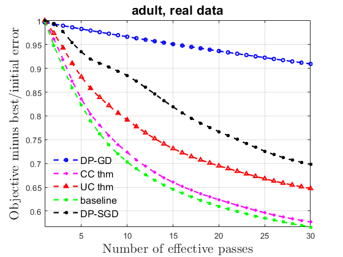

# Demo for AClipped-dpSGD  
A demo for Aclipped-dpSGD proposed in *Efficient Private SCO for Heavy-Tailed Data via Averaged Clipping*.

## Usage

All algorithms are implemented in C++.

To run the demo in MATLAB, first run `mex_all` in the MATLAB terminal to generate the mex file. (Note that the compiler should support at least `c++11`)

Then, run `TEST` and `test_diabetes` in the MATLAB terminal, a small demo training ridge and logistic regression with σ=m=200\sigma=m=200 using Adult dataset `a9a` and σ=m=200\sigma=m=200 using Diabetes dateset from [LIBSVM Data]
(https://www.csie.ntu.edu.tw/~cjlin/libsvmtools/datasets/), to generate a plot of ridge regression task on the Adult dataset with ϵ=1.0\epsilon=1.0 shown  below.

Test environment: PC device with Intel Core i7-6700 with 3.40GHz cores, 8GB RAM, Windows 10 with MinGW-w64 C/C++ Compiler, MATLAB R2021a.


>> TEST
Building with 'MinGW64 Compiler (C++)'.
MEX completed successfully.
Algorithm: DP_GD
Time: 9.385092 seconds 
Algorithm: T3
Time: 0.534383 seconds 
Algorithm: T2
Time: 0.536713 seconds 
Algorithm: dpSGD
Time: 0.581619 seconds 
Algorithm: CSGD
Time: 0.502956 seconds 


``````
